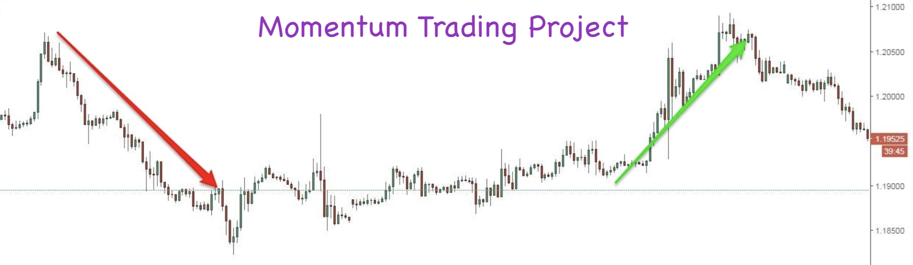

# Momentum-trading-strategy



## Table of Contents
1. [Description](#project_overview)
2. [Getting Started](#getting_started)
	1. [Dependencies](#dependencies)
	2. [Installing](#installing)
	3. [Results](#executing)
3. [Authors](#authors)
4. [License](#license)
5. [Acknowledgement](#acknowledgement)
6. [Publication](#published)

<a name="project_overview"></a>
## Project Overview

In this project, momentum trading strategies were implement, and tested to see if momentum strategies have the potential to be profitable; trading signal based on a momentum indicator were generated. The data consisted of a universe of stocks and time range (end of day from Quotemedia). The signals were computed for the time range given and applied to the dataset to produce projected returns. Finally, statistical test were performed on the mean of the returns to conclude if there is alpha in the signal.


Objective

Simply, demonstrate how to develop momentum trading signals and test if they are any good. 
Four steps:

1) Explore the data (resample adjusted prices)
2) Compute log returns and shift returns
3) Generate trading signals
4) Statistical tests (compute t- and p-values)

<a name="getting_started"></a>
## Getting Started

<a name="dependencies"></a>
### Dependencies
All installed using pip withing the notebook for your convenience
* colour==0.1.5
* cvxpy==1.0.3
* cycler==0.10.0
* numpy==1.13.3
* pandas==0.21.1
* plotly==2.2.3
* pyparsing==2.2.0
* python-dateutil==2.6.1
* pytz==2017.3
* requests==2.18.4
* scipy==1.0.0
* scikit-learn==0.19.1
* six==1.11.0
* tqdm==4.19.5

<a name="installing"></a>
### Installing
Clone this GIT repository:
```
git clone https://github.com/geovani-montoya/trading_momentum_strategy
```
<a name="executing"></a>
### Results:
Given the trading signals from a momentum trading strategy, it was observed that the p-value was 0.08. Since the observed p-value is greater than the chosen alpha of 0.05, the null hypothesis (actual meaning the return is zero) cannot be rejected. Therfore, we can concluded that it is unlikely that we will observe an annualized rate of return of 3.68% or greater. In other words, the trading signal used is NOT statistically significant and most-likely will not give a positive return.


<a name="authors"></a>
## Authors

[Geovani Montoya](https://github.com/geovani-montoya)

[Portfolio website](https://geovani-montoya.github.io)

[LinkedIn](https://www.linkedin.com/in/geovani-montoya/)

<a name="license"></a>
## License
[](https://opensource.org/licenses/MIT)

<a name="acknowledgement"></a>
## Acknowledgements

* [Udacity](https://www.udacity.com/) extensive curriculum in Artificial Intelligence for Trading Nanodegree

